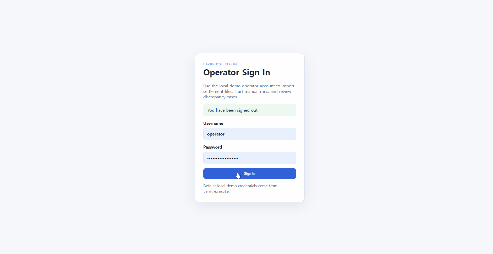
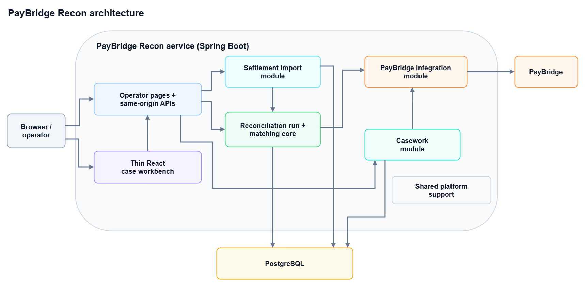
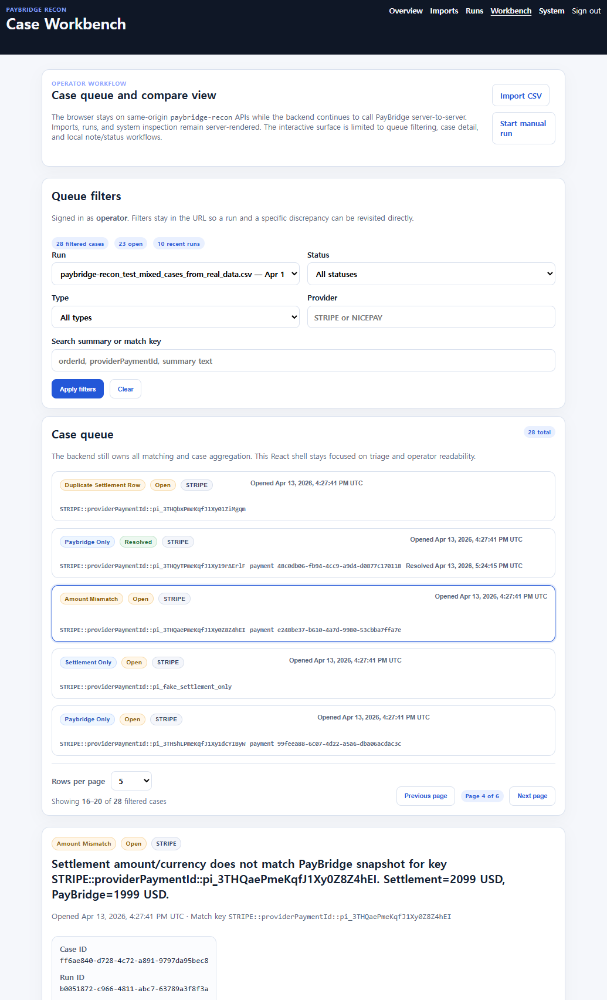
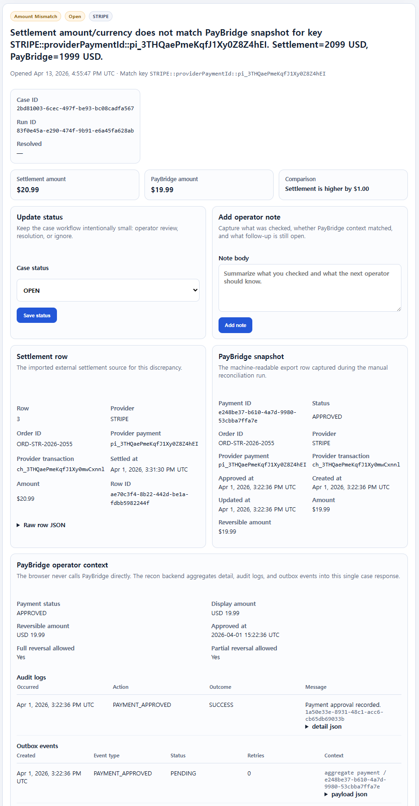
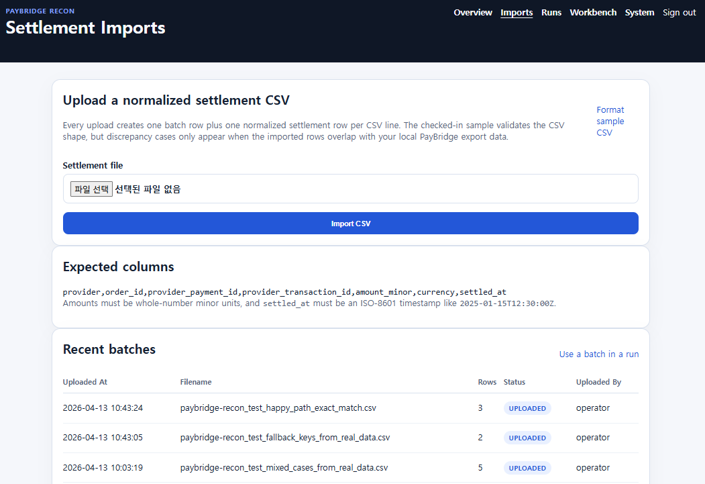
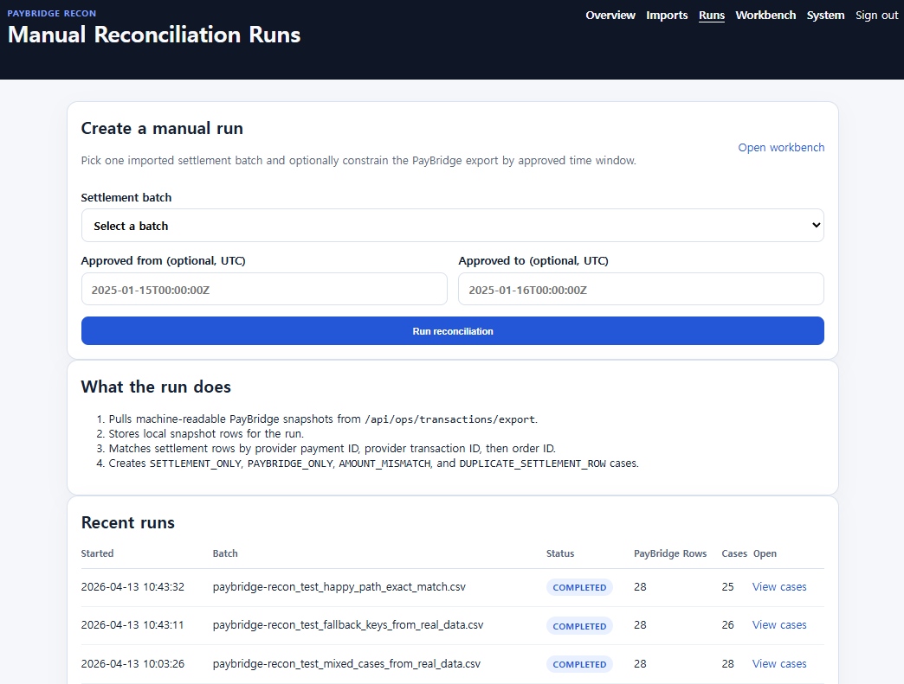

# PayBridge Recon

[](LICENSE.txt)

PayBridge Recon is a backend first settlement and reconciliation workbench that compares imported settlement data against a machine-readable PayBridge export, creates discrepancy cases, and gives operators a focused case review surface.

PayBridge Recon exists because approval and reversal flows are only part of the payment lifecycle. Once settlement data arrives from an external source, operators still need a safe way to compare both sides, isolate mismatches, and preserve investigation context without pushing repair logic back into the core payment service.

---
## Table of Contents
- [Demo walkthrough](#demo-walkthrough)
- [Why I built this](#why-i-built-this)
- [What this project demonstrates](#what-this-project-demonstrates)
- [Tech Stack](#tech-stack)
- [System overview](#system-overview)
- [Responsibility split with PayBridge](#responsibility-split-with-paybridge)
- [Main flows](#main-flows)
- [Repository map](#repository-map)
- [Local run](#local-run)
- [Routes](#routes)
- [Interface snapshots](#interface-snapshots)
- [Manual smoke test](#manual-smoke-test)
- [Reliability and data quality highlights](#reliability-and-data-quality-highlights)
- [Testing](#testing)
- [Additional docs](#additional-docs)

---
## Demo walkthrough

<p align="center">
  
</p>

<p align="center">
  <sub><strong>Demo scope:</strong> sign in → settlement import → manual run → case queue → case detail → status update → note creation → system connectivity check.</sub>
</p>

---
## Why I built this

PayBridge focuses on approval, reversal, webhook handling, audit, and outbox behavior. PayBridge Recon focuses on the next operational step: comparing imported settlement rows against a normalized export from the core payment system.

That split keeps both repositories easier to review:

- **PayBridge** stays focused on provider aware payment execution and transaction visibility.
- **PayBridge Recon** stays focused on settlement import, snapshot capture, matching, and operator case triage.

The project is intentionally small, but it models the parts that make reconciliation work more realistic than a simple CSV diff:

- imported batch provenance
- persisted PayBridge snapshots per run
- explicit discrepancy case types
- operator notes and status changes
- optional PayBridge detail, audit, and outbox context on the case screen

---
## What this project demonstrates

### For payment and fintech work

- A **settlement comparison workflow** built around machine readable payment data rather than display string parsing
- A **case domain** for `SETTLEMENT_ONLY`, `PAYBRIDGE_ONLY`, `AMOUNT_MISMATCH`, and `DUPLICATE_SETTLEMENT_ROW`
- A practical split between the **core payment system** and a **read/triage-first reconciliation surface**
- Graceful handling when **PayBridge detail, audit, or outbox endpoints fail independently**

### For general backend work

- A focused **Spring Boot companion service** with JPA, Flyway, validation, security, and REST + server rendered UI boundaries
- A predictable **import → snapshot → match → case** pipeline
- A focused **React case workbench** that consumes same origin APIs while leaving matching and aggregation logic on the backend
- Coverage across **parser tests, service tests, integration tests, and small frontend unit tests**

---
## Tech Stack

| Category | Choice |
| --- | --- |
| Language / runtime | Java 21 |
| Framework | Spring Boot 3.5.12 |
| Architecture style | Companion reconciliation service |
| UI | Spring MVC + Thymeleaf pages plus a focused React case workbench |
| Database | PostgreSQL 16 |
| Schema management | Flyway |
| Upstream dependency | PayBridge operator export and activity APIs |
| Reliability controls | Batch provenance, persisted snapshots, explicit case types, operator notes, graceful handling of partial PayBridge context failures |
| Cross-cutting support | Spring Security, validation, error handling, correlation IDs, OpenAPI |
| Testing | JUnit 5, Spring Boot integration tests, WireMock, Vitest |
| CI | GitHub Actions |

---
## System overview

<p align="center">
  
</p>

<p align="center">
  <sub><strong>Architecture view:</strong> one Spring Boot companion service. Operators use server rendered pages and same origin APIs to import settlement files, start manual reconciliation runs, review discrepancy cases, and load optional PayBridge context. The service stores imported settlement rows, persisted PayBridge snapshots, and local casework state in PostgreSQL while keeping PayBridge access on a server to server boundary.</sub>
</p>

---
## Responsibility split with PayBridge

| Concern | PayBridge | PayBridge Recon |
| --- | --- | --- |
| Approval / reversal execution | Owns provider-specific execution and persistence | Does not execute provider mutations |
| Webhooks | Owns webhook verification and duplicate suppression | Does not receive provider webhooks |
| Audit / outbox writes | Owns lifecycle audit and outbox rows | Reads related audit and outbox context for case review |
| Settlement import | Not modeled | Owns CSV import and batch history |
| Reconciliation run | Exposes machine-readable export rows | Pulls export rows, persists snapshots, runs matching |
| Discrepancy handling | Exposes transaction detail | Owns discrepancy cases, notes, and status transitions |

---
## Main flows

### 1) Import a settlement batch

1. An operator uploads a normalized CSV at `/imports`.
2. PayBridge Recon validates the header order and required fields.
3. The service persists one import batch row and one normalized settlement row per CSV line.

### 2) Start a reconciliation run

1. An operator picks an imported batch at `/runs/new`.
2. PayBridge Recon pulls one or more pages from `GET /api/ops/transactions/export` on PayBridge.
3. The service stores one local snapshot row per exported payment.
4. The matcher compares settlement rows and snapshots using provider payment id, provider transaction id, and order id.
5. The service creates discrepancy cases with default `OPEN` status.

### 3) Review discrepancy cases

1. The operator opens `/workbench/cases`.
2. The React workbench loads bootstrap data, the case queue, and one selected case through same origin Recon APIs.
3. The case detail screen shows the settlement row, the captured PayBridge snapshot, and optional PayBridge detail, audit logs, and outbox events.
4. The operator can update the case status and add notes without mutating PayBridge.

---
## Repository map

- [`src/main/java/com/paybridge/recon/settlement`](src/main/java/com/paybridge/recon/settlement) — CSV parsing, batch persistence, and import orchestration
- [`src/main/java/com/paybridge/recon/run`](src/main/java/com/paybridge/recon/run) — manual run orchestration, snapshot persistence, and matching
- [`src/main/java/com/paybridge/recon/casework`](src/main/java/com/paybridge/recon/casework) — discrepancy case query and command services
- [`src/main/java/com/paybridge/recon/integration/paybridge`](src/main/java/com/paybridge/recon/integration/paybridge) — upstream PayBridge client and context aggregation
- [`src/main/java/com/paybridge/recon/web`](src/main/java/com/paybridge/recon/web) — home, imports, runs, workbench, and system controllers
- [`src/main/resources/templates`](src/main/resources/templates) — server rendered pages
- [`frontend`](frontend) — React/TypeScript source for the case workbench
- [`docs/adr`](docs/adr) — architecture decisions
- [`docs/project-notes/paybridge-recon-project-overview.md`](docs/project-notes/paybridge-recon-project-overview.md) — technical walkthrough for code review
- [`docs/runbooks/local-operator-runbook.md`](docs/runbooks/local-operator-runbook.md) — local setup and manual verification guide
- [`docs/openapi/paybridge-recon.yaml`](docs/openapi/paybridge-recon.yaml) — checked in OpenAPI reference for JSON endpoints
- [`scripts/dev/bootstrap.sh`](scripts/dev/bootstrap.sh) — small helper for local Docker bootstrap

---
## Local run

### Fastest path: local JVM + Dockerized PostgreSQL

```bash
cp .env.example .env
./scripts/dev/bootstrap.sh db

# .env is used by Docker Compose, but `bootRun` does not automatically read it.
# Export the variables in your shell or configure them in your IDE before starting the app.

export PAYBRIDGE_RECON_DB_URL=jdbc:postgresql://localhost:5433/paybridge_recon
export PAYBRIDGE_RECON_DB_USERNAME=paybridge_recon
export PAYBRIDGE_RECON_DB_PASSWORD=paybridge_recon
export PAYBRIDGE_RECON_OPERATOR_USERNAME=operator
export PAYBRIDGE_RECON_OPERATOR_PASSWORD=operator-change-me

./gradlew bootRun --args="--spring.profiles.active=local"
```

For a full Docker Compose run of PostgreSQL plus the app container:

```bash
cp .env.example .env
./scripts/dev/bootstrap.sh full
```

Requirements:

- Java 21
- Docker (recommended for PostgreSQL)
- a local PayBridge instance running on `http://localhost:8080`
- the companion-facing PayBridge read contract enabled for local use:
  - required: `GET /api/ops/transactions/export`
  - optional but used by case detail enrichment: `GET /api/ops/transactions/{paymentId}`, `/audit-logs`, and `/outbox-events`

Default local demo operator credentials come from `.env.example`:

- username: `operator`
- password: `operator-change-me`

### Frontend workspace

The workbench source lives under `frontend/`.

Useful commands after `cd frontend && npm ci` (Node 24 recommended for the workspace toolchain):

```bash
npm run dev
npm run test
npm run build
npm run build:runtime
```

The repository also checks in the TypeScript compiled runtime entry under `src/main/resources/static/workbench/` so the `/workbench/cases` route can render without an additional frontend deployment step.

---
## Routes

| Route | Purpose | Access |
| --- | --- | --- |
| `/` | Overview page | Operator |
| `/operator/login` | Local operator sign-in | Public |
| `/imports` | Settlement CSV import and batch history | Operator |
| `/runs/new` | Manual run creation and recent run history | Operator |
| `/workbench/cases` | Case queue and detail workbench | Operator |
| `/system` | Runtime metadata and PayBridge connectivity page | Operator |
| `/api/system/info` | Runtime metadata JSON endpoint | Public |
| `/api/recon/workbench/bootstrap` | Workbench bootstrap JSON endpoint | Operator |
| `/api/recon/runs` | Manual run creation JSON endpoint | Operator |
| `/api/recon/cases` | Case queue JSON endpoint | Operator |
| `/api/recon/cases/{caseId}` | Case detail JSON endpoint | Operator |
| `/api/recon/cases/{caseId}/status` | Case status update JSON endpoint | Operator |
| `/api/recon/cases/{caseId}/notes` | Case note creation JSON endpoint | Operator |
| `/swagger-ui/index.html` | Runtime OpenAPI UI | Public when enabled in local/dev/docker |
| `/api-docs` | Runtime OpenAPI JSON | Public when enabled in local/dev/docker |

---
## Interface snapshots

<p align="center">
  
</p>

<p align="center">
  <sub><strong>Operator view:</strong> the workbench keeps queue filters, selected case detail, local notes, and status transitions inside one same-origin review surface while showing the imported settlement row, the persisted PayBridge snapshot, and optional upstream detail context together.</sub>
</p>

<br>

<details>
  <summary><strong>🖼️ Click to view workbench detail page</strong></summary>
  <p align="center">
    
  </p>
</details>

<details>
  <summary><strong>🖼️ Click to view import page</strong></summary>
  <p align="center">
    
  </p>
</details>

<details>
  <summary><strong>🖼️ Click to view manual run page</strong></summary>
  <p align="center">
    
  </p>
</details>

---
## Manual smoke test

1. Start PayBridge and confirm `GET http://localhost:8080/api/system/info` succeeds.
2. Start PayBridge Recon and sign in at `/operator/login`.
3. Import `docs/samples/settlement-sample.csv` if you only want to verify the CSV contract, or import a file built from overlapping local PayBridge data if you want discrepancy cases.
4. Create a run from `/runs/new`.
5. Open `/workbench/cases` and verify that cases appear in the queue when the imported rows overlap the local PayBridge export.
6. Select an amount mismatch case and compare the settlement row against the PayBridge snapshot.
7. Update the case status and add an operator note.
8. Open `/system` and verify that PayBridge connectivity metadata is visible.

The checked in sample is a format sample, not a guaranteed end to end discrepancy fixture.

A more detailed checklist lives in [`docs/runbooks/local-operator-runbook.md`](docs/runbooks/local-operator-runbook.md).

---
## Reliability and data-quality highlights

- **Normalized settlement import** with explicit header validation
- **Persisted run snapshots** so the workbench reviews the exact export rows used during matching
- **Deterministic matching order**: provider payment id → provider transaction id → order id
- **Explicit duplicate settlement row detection** instead of silently dropping ambiguous rows
- **Case notes and status transitions** that preserve investigation context locally
- **Graceful handling when PayBridge detail, audit, or outbox endpoints fail independently**
- **Correlation IDs** added to request handling and surfaced in runtime logging

---
## Testing

The project includes:

- parser tests for settlement CSV validation
- matcher tests for discrepancy case generation rules
- service tests for PayBridge context aggregation behavior
- integration tests for imports, runs, case APIs, security, and validation behavior
- small React tests for URL state, badges, and case detail interactions
- GitHub Actions checks for both the backend test suite and the frontend unit test/runtime build path

Current integration tests run on H2 with Hibernate `create-drop`. They validate the service flows and HTTP contracts, but they do not validate Flyway migrations against PostgreSQL.

To generate a backend coverage report locally:

```bash
./gradlew test jacocoTestReport
```

The HTML report is written to `build/reports/jacoco/test/html/index.html`.

---
## Additional docs

- [ADR-001 — companion reconciliation service boundary](docs/adr/ADR-001-companion-reconciliation-service-boundary.md)
- [ADR-002 — manual import and run before scheduler automation](docs/adr/ADR-002-manual-import-and-run-before-scheduler.md)
- [ADR-003 — server-rendered operator pages with a thin React workbench](docs/adr/ADR-003-server-rendered-pages-with-thin-react-workbench.md)
- [Checked-in OpenAPI spec](docs/openapi/paybridge-recon.yaml)
